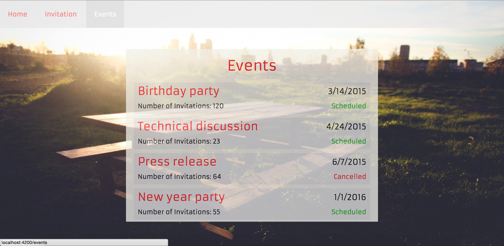

# Intercom

##### Instructions

1. `git clone https://github.com/djvoa12/intercom.git`
2. `npm i && bower i`
3. `ember s`
4. `ember t` (to see tests)

Note: The API requests are stubbed with `ember-cli-mirage`. Under `invitation` route, it's returning the same response as `customers.txt`. To see it actually fetch the text file, you need to turn off `ember-cli-mirage` (i.e. change line 26's `true` to `false` in `config/environment.js`).

